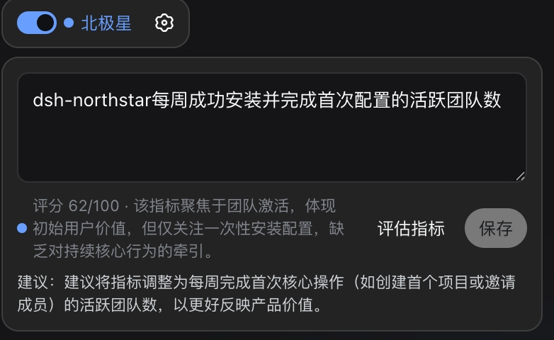
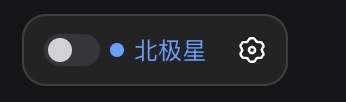
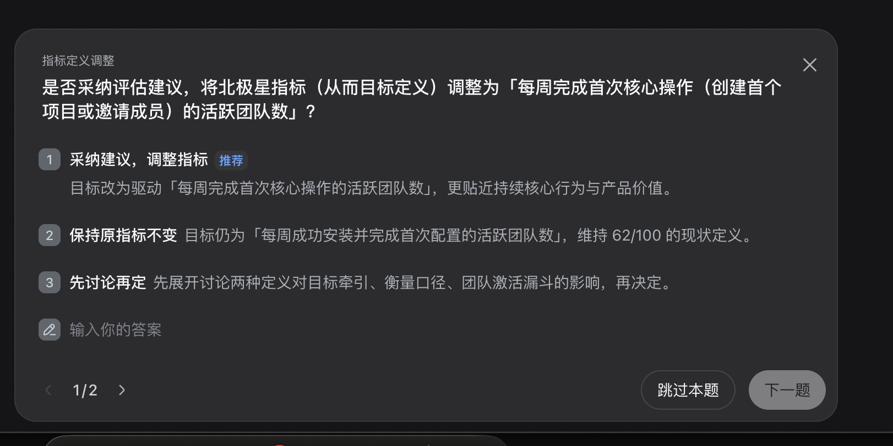
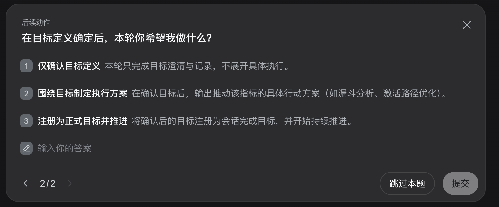
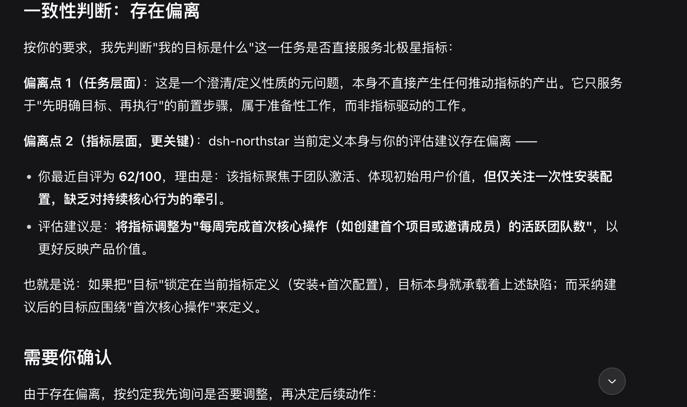

# dsh-northstar

<p align="center">
  
</p>

让 DeepSeek Harness 的每个任务都先对齐你的北极星指标。

`dsh-northstar` 是一个极简的本地插件：它把一个开关和一个配置按钮放进 Harness 首页，用户用自然语言保存一句北极星指标。指标只有在用户主动点击“评估指标”后，才会调用当前 DSH 模型进行语义评分；每次任务仍会在模型请求前经过 `agent/pre-step`，把北极星指标交给当前任务模型判断是否偏离。

## 产品行为

- 首页入口由产品 logo、状态色 switch 和一个“配置”按钮组成；logo hover 时提示“北极星指标”。
- 指标为空时自动展开输入框；已有指标时默认收起。
- 配置面板提供“评估指标”按钮；输入、保存、开关切换和任务开始都不会自动发送评估请求。
- 指标评分为 0–100 分，状态使用六档颜色：灰色 = 未评估，红色 = 偏弱，橙色 = 需要补强，黄色 = 基础明确，蓝色 = 较强，绿色 = 高质量。
- 首次打开时提供高分写法示例：“获取 1,000 名目标 DSH 用户安装并使用 dsh-northstar。”
- switch 可以随时开启或关闭；关闭时不做任务门禁。
- 指标和最近一次评估结果保存在 Harness 的本地 `settings.yaml`，命名空间为 `northstar`；指标文本不会由插件自动上传，只有点击评估按钮时才会发送给当前模型。
- 任务检查发生在模型请求前。插件不再做关键词硬匹配，而是把指标、最近一次评估和当前任务作为上下文交给正常任务模型判断，要求模型在偏离时先指出问题。

首页入口使用 DSH 官方的 `shell.overlay` additive slot，定位在主内容区顶部左侧，随侧边栏展开、收起和拖拽自适应，不替换内置 Agent Preset，也不改动 DSH 的 DOM 或视觉 token。配置面板从入口下方展开，并在窄屏下限制宽度。

## 产品使用截图

### 1. 手动开启北极星检查并查看状态

首页入口以紧凑卡片呈现。开启后，Switch 会显示当前指标的评分颜色和状态，用户可以点击配置图标编辑或重新评估指标。



### 2. 手动关闭北极星检查

北极星检查可以随时手动关闭。关闭后不会在任务开始前注入北极星提醒，指标配置仍然保留，之后可以再次开启。



### 3. 评估建议由用户确认

当北极星指标完成一次评估后，DeepSeek 会给出指标调整建议。用户可以选择采纳建议、保持原指标，或先继续讨论；插件不会自动修改已经保存的指标。



### 4. 确认指标后的后续动作

目标定义确认后，用户可以选择只记录目标、围绕目标制定执行方案，或将目标注册为正式目标并持续推进。这样可以把“指标评估”和“具体执行”分成两个明确步骤。



### 5. 任务开始前的偏离判断

开启北极星检查后，任务模型会先判断当前任务是否直接服务北极星指标。如果存在偏离，会先说明偏离点并请求确认，而不是直接扩展到无关工作。



## 判断方式

当前版本采用“用户主动触发的模型评估 + 任务前上下文提醒”：

1. 用户点击“评估指标”后，插件通过 DSH 的统一 `ctx.llm.stream` 调用当前默认模型，要求模型按照六个维度评分：用户价值 > 核心行为 > 商业关联 > 领先性 > 可影响性 > 可衡量性。
2. 模型返回总分、六个维度分数、总结和改进建议。插件只校验返回结构，不根据关键词自行推断语义。
3. 任务开始前不额外发起评估模型调用。插件只注入北极星上下文，由当前任务模型在正常回答中判断任务是否服务北极星指标。

评分结果不会限制 Switch 的交互，开关只表达用户是否启用任务前提醒。

## 开发

```bash
pnpm install
pnpm test
pnpm typecheck
pnpm build
```

插件包包含 Host、Typert Remote 和 Browser client 三个入口，并通过 `cordis.patch.yml` 插入 DSH profile。发布前请使用实际 Harness profile 安装并验证首页入口、模型评估、设置持久化和首轮任务上下文。

## 安装

在已安装 DeepSeek Harness 的环境中，将本仓库作为 DSH 插件包加入目标 profile，并刷新 Web client：

```bash
dsh plugin --profile web add dsh-northstar
```

如果使用本地构建包，将 `dsh-northstar` 替换为本地包路径或已发布的包版本。

## License

Apache-2.0，见 [LICENSE](./LICENSE)。
